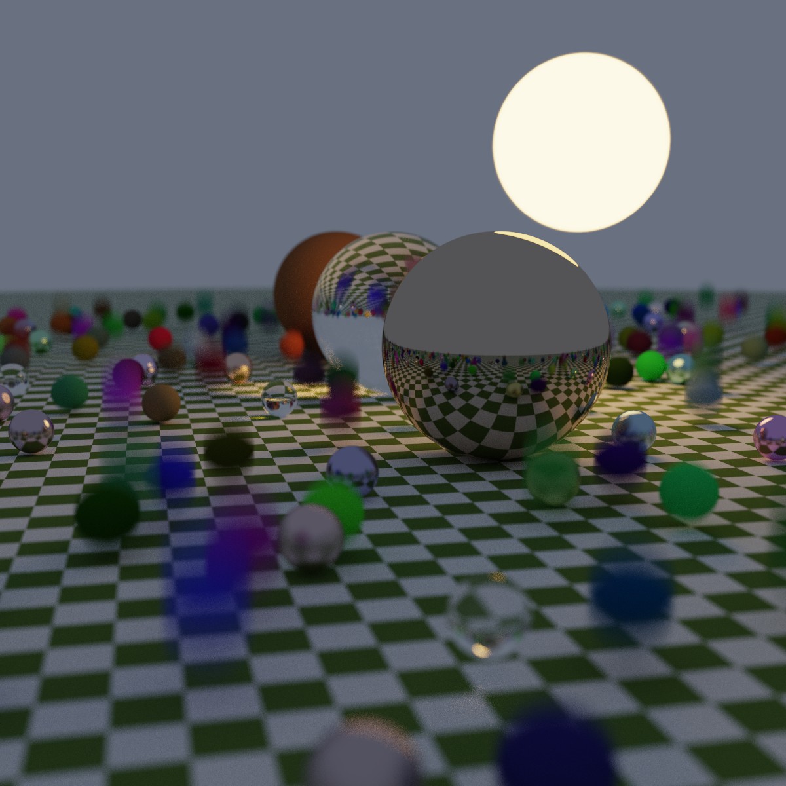

# Render

## Overview

Render is a physically based ray tracer project developed as part of Coms 336. The project started with the three books "Ray Tracing in One Weekend," "Ray Tracing: The Next Week," and "Ray Tracing: The Rest of Your Life." It includes various advanced features such as:

- Configurable Camera
- Lambertian reflection
- Metal and glass materials
- Metallic surfaces as mirrors
- Importance sampling
- Bidirectional Reflectance Distribution Functions (BRDFs)
- Shadows
- Probability Density Functions (PDFs)
- Perlin noise
- Quadrilateral and spherical objects

Building on the concepts from these books, I have personally extended the ray tracer to include:
- Trinagle meshes
- Multi-threading (no GPU acceleration)
- Cube maps
- Post-processing effects like bloom and glare
- HDR renders
  
## Features

1. **Materials**:
   - **Lambertian**: Diffuse reflection.
   - **Metal**: Reflective surfaces with varying fuzziness.
   - **Glass**: Refractive surfaces simulating realistic glass.

2. **Geometry**:
   - **Triangle meshes**: Efficient representation of complex shapes.
   - **Quads and spheres**: Simplified geometric primitives.

3. **Lighting and Shadows**:
   - **Importance sampling**: Optimized sampling for light sources.
   - **BRDFs**: Accurate light reflection models.
   - **Shadows**: Realistic shadow casting from objects.

4. **Textures**:
   - **Perlin noise**: Procedural texture generation.
   - **Cube maps**: Environment mapping for reflections.

5. **Post-Processing**:
   - **Bloom and glare**: Enhanced lighting effects.

6. **Performance**:
   - **Multi-threading**: Improved rendering speed using multiple CPU cores.
  
## Rendered Images

Here are some examples of images rendered using this ray tracer:

### Bouncing Spheres


### Chess


### Post-processing


## How to Use

### Prerequisites

- C++ Compiler (e.g., GCC, Clang)
- CMake (version 3.10 or higher)
- Git (for cloning the repository)

### Building the Project

1. Clone the repository:
   ```sh
   git clone https://github.com/Andrew-Vick/Render.git
   cd Render
2. Create a build directory:
   ```
   cmake -B build
3. Build project using CMake:
   ```
   cmake --build ./build
4. Run the ray tracer:
   ```
   ./inOneWeeked

### Coordinate System

The ray tracer uses a right-handed coordinate system with the following conventions:

- **X-axis**: Positive X is to the right, negative X is to the left.
- **Y-axis**: Positive Y is upwards, negative Y is downwards.
- **Z-axis**: Positive Z is towards the camera, negative Z is away from the camera.

### Points and Vectors

Points and vectors define the structure of the scene:

- **point3**: Represents a 3D point in space.
- **vec3**: Represents a 3D vector used for directions, offsets, and calculations.
- **color**: Represents an RGB color value.

### Rendering Process

The ray tracer simulates light by casting rays from a virtual camera into the scene, computing interactions with objects, and determining the final pixel color. The core steps include:

1. **Ray Generation**  
   - A ray is defined by an origin (camera position) and a direction.  
   - Each pixel in the image corresponds to a ray cast through the scene.

2. **Object Intersection**  
   - Rays are tested against objects (e.g., spheres, quads, boxes) to find the closest intersection.  
   - If a ray hits an object, the intersection point, surface normal, and material properties are computed.

3. **Shading & Lighting**  
   - The color at an intersection is determined based on material properties and light interactions.  
   - Support for diffuse surfaces, reflections, and refractions is handled via recursive ray tracing.

4. **Recursive Ray Tracing**  
   - If an object is reflective or transparent, secondary rays (reflection/refraction) are cast to determine indirect lighting effects.  
   - This recursion continues until a termination condition (depth limit or negligible contribution) is met.

5. **Final Image Composition**  
   - The computed color for each pixel is stored and written to an image file.

### Object Representation

Objects in the scene are defined with their geometric properties and materials:

#### **Spheres**
```cpp
make_shared<sphere>(point3(x, y, z), radius, material);
```
- **Center**: the spheres position.
- **Radius**: Size of the sphere
- **material**: Determines how light interacts with the sphere.

### **Boxes**
```cpp
box(corner1, corner2, material);
```
- **corner1, corner2**: opposite corners defining the box's dimensions.
- **material**: Determines the box's surface properties.

### **Quads**
```cpp
make_shared<quad>(corner, u, v, material);
```
- **corner**: A point3 defining the bottom-left corner.
- **u, v**: Vectors defining the width and height.
- **material**: the material of the quad
